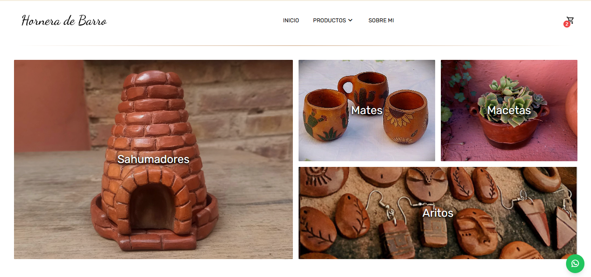
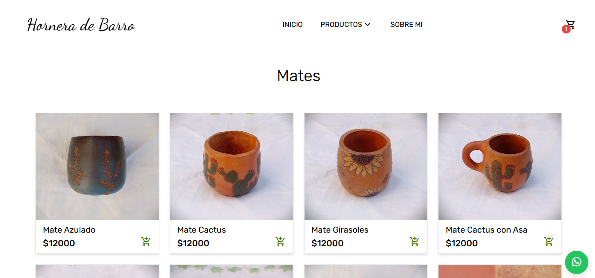
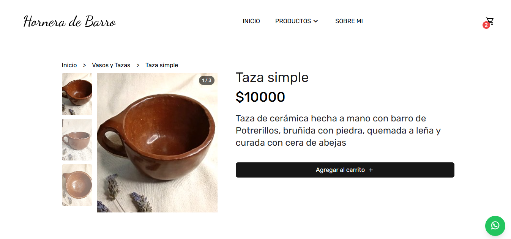

> ⚠️ Este proyecto está actualmente en desarrollo activo. Algunas funcionalidades pueden estar incompletas o sujetas a cambios.

# Web Hornera de Barro - Backend

Backend y API REST del catálogo digital **Hornera de Barro**, desarrollado con Node.js, Express, MongoDB y Mongoose.

La API administra los productos, categorías y autenticación del administrador, además de gestionar la carga de imágenes mediante Cloudinary.

---

## API en producción

**Backend:**
https://webhorneradebarro-back.onrender.com/

### Endpoints principales

**Productos:**
https://webhorneradebarro-back.onrender.com/products

**Categorías:**
https://webhorneradebarro-back.onrender.com/categories

---

## Información general

Este repositorio contiene el backend de Hornera de Barro.

La aplicación está desarrollada como una API REST que proporciona los datos necesarios para que el frontend pueda consultar y gestionar el catálogo de productos.

El servidor administra:

* Productos
* Categorías
* Autenticación del administrador
* Imágenes de productos
* Disponibilidad de productos
* Productos destacados
* Persistencia de datos en MongoDB

El backend está desplegado en Render y utiliza MongoDB Atlas como base de datos.

---

## Funcionalidades

### Productos

* Obtener todos los productos
* Obtener un producto por ID
* Crear productos
* Editar productos
* Eliminar productos
* Gestionar disponibilidad
* Gestionar productos destacados
* Cargar y eliminar imágenes mediante Cloudinary

### Categorías

* Obtener todas las categorías
* Obtener una categoría por ID
* Crear categorías
* Editar categorías
* Eliminar categorías
* Relacionar productos con categorías

### Administración

* Login del administrador
* Autenticación mediante JWT
* Verificación del token
* Actualización de los datos del administrador
* Contraseñas protegidas mediante bcrypt
* Rutas administrativas protegidas

---

## Tecnologías utilizadas

* **Node.js** — Entorno de ejecución
* **Express** — Framework para el servidor y la API REST
* **MongoDB** — Base de datos NoSQL
* **Mongoose** — Modelado y acceso a MongoDB
* **JWT** — Autenticación mediante tokens
* **bcrypt** — Hashing de contraseñas
* **Multer** — Procesamiento de archivos
* **Cloudinary** — Almacenamiento de imágenes
* **CORS** — Configuración de acceso entre dominios
* **dotenv** — Gestión de variables de entorno

---

## API

### Productos

| Método | Endpoint                          | Descripción                                   |
| ------ | --------------------------------- | --------------------------------------------- |
| GET    | `/products`                       | Obtener todos los productos                   |
| GET    | `/products/:id`                   | Obtener un producto por ID                    |
| POST   | `/products`                       | Crear un producto                             |
| PUT    | `/products/:id`                   | Actualizar un producto                        |
| DELETE | `/products/:id`                   | Eliminar un producto                          |
| DELETE | `/products/:id/images/:public_id` | Eliminar una imagen específica de un producto |

### Categorías

| Método | Endpoint          | Descripción                  |
| ------ | ----------------- | ---------------------------- |
| GET    | `/categories`     | Obtener todas las categorías |
| GET    | `/categories/:id` | Obtener una categoría por ID |
| POST   | `/categories`     | Crear una categoría          |
| PUT    | `/categories/:id` | Actualizar una categoría     |
| DELETE | `/categories/:id` | Eliminar una categoría       |

### Administración

| Método | Endpoint                 | Descripción                                  |
| ------ | ------------------------ | -------------------------------------------- |
| POST   | `/admin/login`           | Iniciar sesión                               |
| GET    | `/admin/verificar`       | Verificar la autenticación del administrador |
| PUT    | `/admin/cambiar-usuario` | Actualizar los datos del administrador       |

---

## Servicios externos

### MongoDB Atlas

Utilizado para almacenar:

* Productos
* Categorías
* Información del administrador

### Cloudinary

Utilizado para almacenar y gestionar las imágenes de los productos.

### Render

Utilizado para desplegar el servidor y la API REST.

---

## Frontend

El frontend de la aplicación se encuentra en un repositorio separado:

**[WebHorneraDeBarro - Frontend](https://github.com/SophieRF/WebHorneraDeBarro-front)**

La aplicación está disponible online en:

**[Hornera de Barro - Netlify](https://webhornera.netlify.app/)**

---

## Deploy

El backend está desplegado en Render.

El frontend consume la API mediante la variable de entorno:

```env
VITE_API_URL=https://webhorneradebarro-back.onrender.com
```

Las credenciales de MongoDB, Cloudinary, JWT y administrador se gestionan mediante variables de entorno y no se encuentran almacenadas en el repositorio.

---

## Capturas







---

## Autora

Desarrollado por **Sofia Ferraro** para **Hornera de Barro - cerámica artesanal**.
